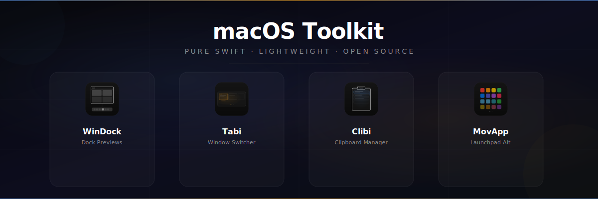

<p align="center">
  
</p>

<h1 align="center">macOS Toolkit</h1>

<p align="center">
  <b>A collection of lightweight, open-source macOS utilities — built with pure Swift.</b><br/>
  No Electron. No dependencies. No bloat.
</p>

<p align="center">
  
  
  
  
</p>

---

## The Suite

Four focused tools that fill the gaps Apple left in macOS.

<table>
  <tr>
    <td align="center" width="25%">
      <a href="https://github.com/akinalpfdn/windock">
        <br/>
        <b>WinDock</b>
      </a><br/>
      <sub>Windows-style dock previews</sub>
    </td>
    <td align="center" width="25%">
      <a href="https://github.com/akinalpfdn/Tabi">
        <br/>
        <b>Tabi</b>
      </a><br/>
      <sub>Window-level Alt+Tab switcher</sub>
    </td>
    <td align="center" width="25%">
      <a href="https://github.com/akinalpfdn/Clibi">
        <br/>
        <b>Clibi</b>
      </a><br/>
      <sub>Clipboard history manager</sub>
    </td>
    <td align="center" width="25%">
      <a href="https://github.com/akinalpfdn/MovApp">
        <br/>
        <b>MovApp</b>
      </a><br/>
      <sub>Launchpad replacement</sub>
    </td>
  </tr>
</table>

---

### WinDock — Dock Preview Extension

> Hover over any dock icon → see live window thumbnails. Click to focus. Aero Peek included.

WinDock hooks into your existing macOS Dock via the Accessibility API and adds Windows 7-style window previews. No custom dock, no replacement — just an enhancement that uses ~23 MB of memory and 0% CPU when idle.

**Highlights:** Live thumbnails via ScreenCaptureKit · Click-to-focus · Aero Peek · Close from preview · Launch at login

<p align="center">
  
</p>

[](https://github.com/akinalpfdn/windock/releases/latest/download/WinDock.dmg)

[📦 Repository](https://github.com/akinalpfdn/windock) · [📋 Releases](https://github.com/akinalpfdn/windock/releases)

---

### Tabi — Window Switcher

> The window switcher macOS forgot to ship. Press `⌥ Tab` to see every open window with live thumbnails.

macOS `⌘ Tab` switches apps, not windows. Tabi fixes that. Full-screen picker showing live thumbnails of every open window across all apps. No menu bar icon, no preferences window, no bloat — it just works.

**Highlights:** `⌥ Tab` to switch · Live window thumbnails · Works across all apps · Zero UI chrome

<p align="center">
  
</p>

[](https://github.com/akinalpfdn/Tabi/releases/latest/download/Tabi-1.0.0.dmg)

[📦 Repository](https://github.com/akinalpfdn/Tabi) · [📋 Releases](https://github.com/akinalpfdn/Tabi/releases)

---

### Clibi — Clipboard Manager

> Press `⌃V` to access your last 100 copied items — text and images — from anywhere.

A silent clipboard history that runs in the background with no dock icon and no menu bar clutter. Search through history, paste directly into apps, and let it remember everything between restarts.

**Highlights:** Text + image history · Custom hotkey · Search · Smart paste · Persistent storage

<p align="center">
  
</p>

[](https://github.com/akinalpfdn/Clibi/releases/latest)

[📦 Repository](https://github.com/akinalpfdn/Clibi) · [📋 Releases](https://github.com/akinalpfdn/Clibi/releases)

---

### MovApp — Launchpad Replacement

> iOS-style app grid with drag-and-drop reordering and complete app uninstallation.

Apple removed the classic Launchpad and replaced it with something worse. MovApp brings back a beautiful, responsive grid view with pagination, search, drag-and-drop rearranging, and the ability to fully uninstall apps along with all their leftover files.

**Highlights:** iOS-style grid · Smart search · Drag & drop reorder · Deep uninstall · Persistent layout

[](https://github.com/akinalpfdn/MovApp/releases/latest)

[📦 Repository](https://github.com/akinalpfdn/MovApp) · [📋 Releases](https://github.com/akinalpfdn/MovApp/releases)

---

## Philosophy

Every app in this toolkit follows the same principles:

- **Pure Swift + AppKit/SwiftUI** — No Electron, no web views, no external dependencies
- **Lightweight** — Minimal memory footprint, 0% idle CPU
- **Invisible** — No dock icons, no menu bar clutter (unless needed)
- **Privacy-first** — All data stays local, nothing is sent anywhere
- **macOS 14+** — Built for modern macOS with native APIs

---

## Clone with Submodules

This repo includes all four apps as git submodules:

```bash
git clone --recurse-submodules https://github.com/akinalpfdn/macos-toolkit.git
```

Or if you've already cloned:

```bash
git submodule update --init --recursive
```

## Project Structure

```
macos-toolkit/
├── README.md
├── assets/              # Banner, demo GIFs, shared assets
├── windock/             # → github.com/akinalpfdn/windock
├── Tabi/                # → github.com/akinalpfdn/Tabi
├── Clibi/               # → github.com/akinalpfdn/Clibi
└── MovApp/              # → github.com/akinalpfdn/MovApp
```

Each subdirectory is a git submodule pointing to its standalone repository. You can open any `.xcodeproj` directly in Xcode.

---

## Requirements

| | Minimum |
|---|---|
| **macOS** | 14.0 (Sonoma) |
| **Xcode** | 15.0+ (build from source) |
| **Arch** | Apple Silicon & Intel |

All apps require **Accessibility** permission. WinDock and Tabi also require **Screen Recording** permission for live window thumbnails.

---

## License

All apps are released under the **MIT License**. See individual repositories for details.

---

<p align="center">
  Built by <a href="https://github.com/akinalpfdn">Akinalp Fidan</a>
</p>
